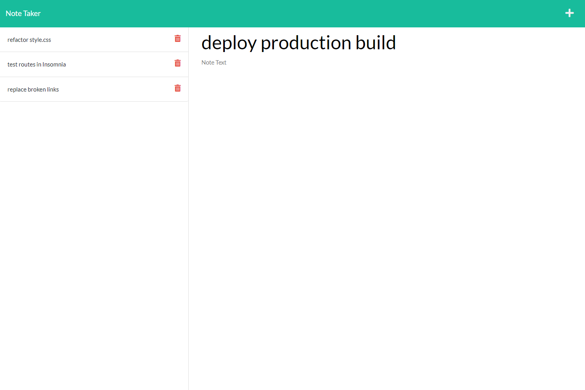

# Note-Taker

An application that allows the user to enter notes. Notes are saved to a JSON file and displayed on the left-hand side of the page, and previous notes can be viewed by clicking on them.

This application uses:  
[Node](https://nodejs.org/en/)  
[Express](https://expressjs.com/)
